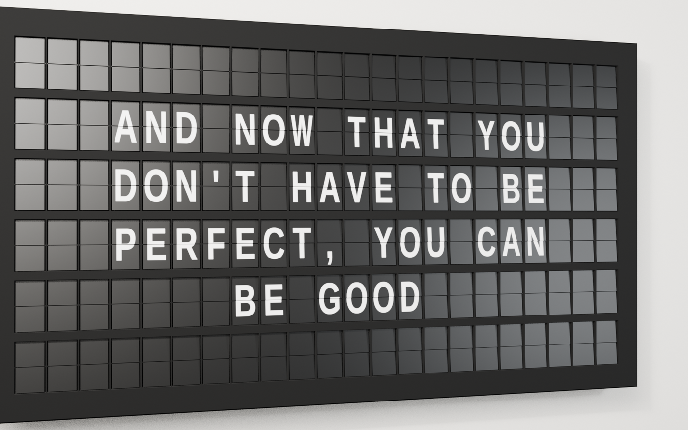
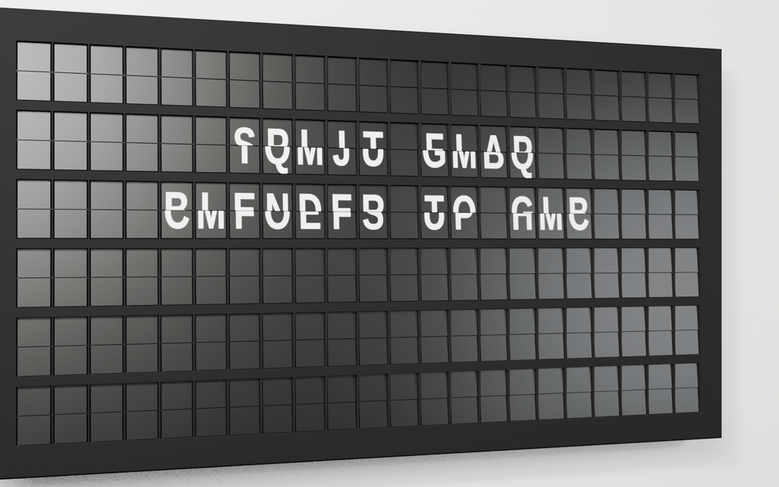
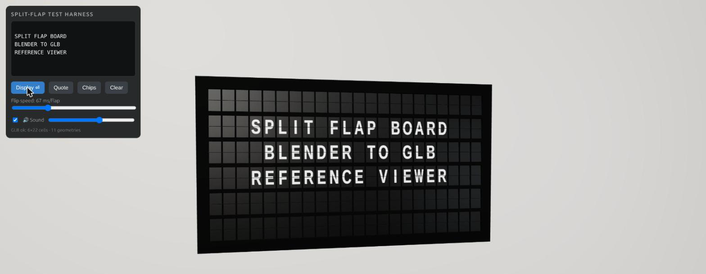

# Split-Flap Board

A parametric Blender generator for a 6×22 **split-flap display** — the
mechanical flip board known from airport and railway departure halls. It
outputs a ready-to-use glTF/GLB asset plus a documented flip-animation
contract, so any real-time application (OpenXR, WebXR, Three.js, Unity,
or anything else that reads glTF) can drive the board itself.






## What it is

The deliverable of this project is not a program. It is a **contract**: a GLB
(`export/splitflap_6x22.glb`) plus an atlas PNG (`assets/atlas/flap_atlas.png`)
plus a fixed set of rules for how a consuming app animates a flip from them.
The Blender package (`blender/splitflap/`) generates that GLB and atlas. The
browser viewer (`viewer/`) is not a demo — it is the **reference
implementation** of the contract, and any app that wants to display this
board is expected to reproduce the same rules.
[The app contract](#the-app-contract) below is the normative specification.

## Quick start

```bash
git clone https://github.com/TimStuhler/splitflap-board.git
cd splitflap-board
./viewer/serve.sh
```

Then open `http://localhost:8123/viewer/`. There is no npm install and no
build step — Three.js is vendored under `viewer/vendor/` and loaded via an
import map, so the server never reaches out to the network.



The viewer loads the GLB and implements the flip logic exactly per the app
contract: text input, a flip-speed slider, quote/chip presets, orbit
controls, and the synthetic flap sound (on/off + level). From the browser
console: `window.__viewer.spell(['','HI','','','',''])`,
`__viewer.spellGrid(grid)`, `__viewer.sound`.

## How it works

`blender/splitflap/charset.py::FLAPS` defines 64 cards — the full character set in a fixed
order. `atlas.build_atlas()` renders them into a single 8×8 atlas PNG.
`board.build()` then builds the board geometry with every card's UVs sitting
on atlas cell 0 (top-left). Displaying a given glyph on a card is therefore
nothing but a UV offset, and that offset is carried in custom properties
(`uv_index`, `uv_front`/`uv_back`) that survive into the GLB as node `extras`.
The export contains no baked-in offsets — the consuming app applies the UV
shift itself.

## The app contract

### Node hierarchy

```
SplitflapBoard                extras: sf_params (JSON), sf_rows, sf_cols
├─ BoardPlate                 front plate + cell walls + stack bulges (static)
├─ BoardCase                  enclosure (static)
├─ AxlePins                   all axle pin hints (static)
└─ Cell_r{r}_c{cc}            empty, origin = the cell's split axis
   ├─ FlapTop_r{r}_c{cc}      static top card    (extras: uv_index)
   ├─ FlapBot_r{r}_c{cc}      static bottom card (extras: uv_index)
   └─ Rotor_r{r}_c{cc}        the flipping card  (extras: uv_front, uv_back)
```

All 264 static cards share a single mesh (`SF_Card`); all 132 rotors share
`SF_CardRotor` (identical geometry, 12 tris in total: 4 face, 8 edge) — the geometry is
deliberately instancing-friendly. Material slots per card: 0 = `SF_Flap_Face`
(the atlas), 1 = `SF_Flap_Edge`.

### Card semantics

Every card carries the **upper** half of an atlas cell on its front face and
the **lower** half on its back face, v-flipped so that it reads upright after
a 180° rotation.

- `FlapTop` rests at −5° (X rotation), showing its front face — the upper
  glyph half.
- `FlapBot` rests at +175° (X rotation), showing its back face — the lower
  glyph half.
- `Rotor` travels from −5° to +175° (local X rotation about the cell
  origin). It sits 0.3 mm in front of the rest plane (a node translation) so
  that it cleanly occludes the static top card at the start of a flip.

### Flip sequence, character k to k+1

1. Make the rotor visible: `uv_front = k`, `uv_back = k+1`, angle −5°.
2. Set `FlapTop.uv_index = k+1` (it is occluded by the rotor, so this is
   invisible).
3. Rotate the rotor to +175° — constant fall at roughly 15 flaps/s, with the
   last flap adding acceleration and a short ~3° bounce on landing.
4. On landing: set `FlapBot.uv_index = k+1`, then hide the rotor.
5. For a character further away, repeat the steps in sequence — the flip
   sequence is the atlas order, modulo 64.

### UV formula

Every card's base UVs sit on **atlas cell 0** (top-left). To display flap
index `i` (0–63):

```
du = (i % 8) / 8      # always
dv = -(i // 8) / 8    # Blender / GL convention: v points UP
dv = +(i // 8) / 8    # glTF convention (this is how it sits in the GLB): v points DOWN
```

> **The sign depends on the UV convention, and this is the single most
> common mistake.** The glTF exporter converts UVs to glTF convention (v
> down, no texture flip). Anyone loading the GLB — Three.js, cgltf, or
> anything else — must use the **positive** `dv` variant. The bundled viewer
> is the reference for this. Only inside Blender itself (the UVWarp driver
> in `board.py`, and `charset.uv_offset()`) does the negative variant apply.

The export contains no baked-in offsets — the UVWarp modifiers are not
applied before export — so the consuming app adds `du`/`dv` itself, e.g. via
a shader uniform.

**Rotor simplification for the app:** before 90° of rotation only the
rotor's front face is visible, and after 90° only its back face is — so a
single UV offset per rotor suffices, switched from `k` to `k+1` exactly at
90°. This is what the viewer does.

### Flap order (= atlas index = flip sequence)

```
 0      blank
 1–26   A–Z
27–36   1 2 3 4 5 6 7 8 9 0
37–55   ! @ # $ ( ) - + & = ; : ' " % , . / ?
56–63   colour chips: red, orange, yellow, green, blue, violet, white, black
```

Defined in `blender/splitflap/charset.py::FLAPS` (chip colours alongside it
as `CHIP_COLORS`).

### Atlas

`assets/atlas/flap_atlas.png` — 2048×4096, sRGB, 8×8 cells of 256×512 px
each. Sampling: clamp/extend, mipmaps are fine (cells carry an edge inset
against bleeding, and the split line sits exactly on the cell's vertical
centre).

## Regenerating in Blender

`blender/splitflap/` runs **inside** Blender (via the running instance), not
as a standalone CLI script:

```python
import sys; sys.path.insert(0, "<repo>/blender")
import splitflap; splitflap.reload_all()      # reload submodules in dependency order
splitflap.build_all(with_atlas=True)          # atlas bake + board + look-dev
```

`build_all` is destructive: `board.build()` deletes the `Splitflap`
collection entirely and rebuilds it from scratch. Dimensions and grid size
live in `blender/splitflap/params.py::BoardParams` — e.g.
`BoardParams(rows=2, cols=10)` for a small test board. The default is 6×22,
board 955×536×66 mm.

Driving the demo animation:

```python
from splitflap import demo
demo.clear_animation()                        # clears only Actions, never drivers
demo.set_text(["", "HELLO", "", "", "", ""])   # sets state without animating
demo.spell(["", "WORLD", "", "", "", ""])      # animated transition, 60 fps
```

**Manual GLB export gotcha:** there is no export script — the GLB is
exported by hand in Blender. Hidden objects are not selectable, so the
rotors must be unhidden before a `use_selection` export, or 132 nodes end up
missing from the GLB.

## Sound

Every click is synthesised at runtime from filtered noise and a sine tone —
no recorded samples are bundled. The current recipe (see the header comment in
`viewer/sound.js`, which is authoritative) targets a bright, papery tick with
a touch of weight, calibrated against a reference recording's spectrum
(energy concentrated in 7–12 kHz, centroid around 6 kHz): a short highpassed
noise tick, a longer bandpassed "paper" layer, and a low-level sine for
body — deliberately without a tonal knock.

Trigger model: a quiet tick plays when a card is released at the start of a
flip, and the full click plays on landing. Each trigger gets independent
random pitch and level jitter, is panned in stereo according to the cell's
column, and a voice cap limits how many clicks can sound in a short window
so a fast multi-cell flip does not turn into noise.

The same recipe is baked to WAV assets for the consuming app (the tick and
paper layers match exactly; the near-inaudible weight layer differs slightly
in implementation, as noted in both file headers):

```bash
python3 tools/gen_click_wavs.py    # -> assets/sound/click_01..05.wav
```

Only this script needs `numpy`; nothing else in the repository does.

## Project layout

| Path | Contents |
|---|---|
| `blender/splitflap/` | The generator package (runs inside Blender) |
| `assets/atlas/` | Baked font atlas (`flap_atlas.png`, 2048×4096) |
| `assets/sound/` | Baked click WAVs for the consuming app |
| `export/` | glTF export (`splitflap_6x22.glb`) |
| `viewer/` | Browser test harness and reference implementation (Three.js, vendored, no CDN) |
| `tools/` | Standalone scripts (currently the click-WAV baker) |
| `docs/` | Architecture notes and published media |
| `splitflap.blend` | The built scene, including look-dev and the demo animation |

## FAQ

**What is a split-flap display?**
An electromechanical display built from stacks of hinged cards. To show a
character, the cards flip forward one at a time until the requested one is on
top, producing the characteristic clattering cascade. Airport and railway
departure boards used them for decades.

**What exactly does this repository produce?**
A glTF binary (`export/splitflap_6x22.glb`, 6×22 = 132 cells), a 2048×4096
character atlas, and the written contract for animating flips from them. It is
an asset plus a specification, not a runtime library.

**Do I need Blender to use it?**
No. The GLB and the atlas are committed, so you can load them directly. Blender
is only needed to regenerate the asset — for example to change the grid size,
the dimensions or the character set.

**How do I animate a flip in my own application?**
Read the node `extras` (`uv_index`, `uv_front`, `uv_back`), rotate the rotor
node from −5° to +175° about its local X axis, and apply the UV offset
`du = (i % 8)/8`, `dv = +(i // 8)/8` in glTF convention. The full sequence is
in [the app contract](#the-app-contract); `viewer/main.js` is a working
reference implementation in about 250 lines.

**Can I change the grid size or the characters?**
Yes. `BoardParams(rows=2, cols=10)` builds a smaller board, and every physical
dimension is a parameter. The 64-card character set lives in
`blender/splitflap/charset.py::FLAPS`; changing it means re-baking the atlas.

**Does it run in a browser?**
Yes — `viewer/` is a plain static page using Three.js, with no build step and
no network access. It also runs unchanged in WebXR-capable browsers.

**Is there a build system or a test suite?**
No, deliberately. The project is an asset pipeline; verification is visual,
through the viewer or Blender renders.

## License & attribution

Licensed under the [MIT License](LICENSE). Third-party material (Three.js,
the font used to bake the atlas, and notes on the synthesised sound) is
listed in [THIRD_PARTY.md](THIRD_PARTY.md).

This is an independent hobby project, not affiliated with or endorsed by any
manufacturer of split-flap displays.

For a closer look at the data flow and the duplicated definitions that must
be kept in sync across Python and JavaScript, see
[docs/ARCHITECTURE.md](docs/ARCHITECTURE.md).
